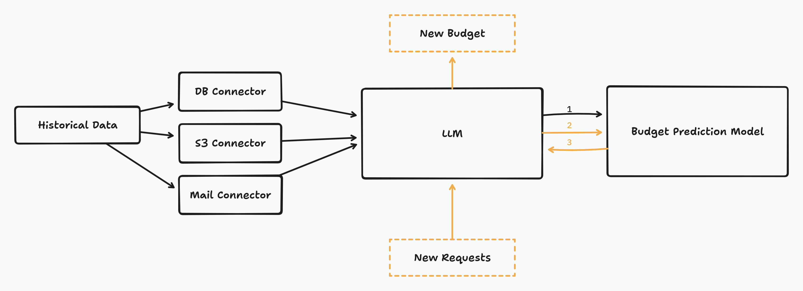

# 🦡 Budger: Your financial friend!

### [Live link](http://ec2-34-210-153-213.us-west-2.compute.amazonaws.com)

## Description  
This application is designed to help businesses efficiently manage and respond to budget requests. By leveraging **Large Language Models (LLMs)** and **Machine Learning (ML)**, the solution parses historical email interactions into structured data and predicts budgets for new customer requests. The approach ensures timely and informed responses, even for businesses with limited resources.  

## Problem Statement  
Small-to-mid-sized businesses often face challenges handling a surge in budget requests, especially after setting up an online presence. Due to limited resources, these businesses may struggle to respond to all requests promptly, leading to potential missed opportunities. Manual handling of unstructured text (e.g., emails) is slow and prone to inconsistencies, making it crucial to streamline this process.  

## Proposed Solution  
Our solution combines **LLMs** and **ML** to address this bottleneck:  

- **Data Parsing with LLMs**:  
   - Historical email interactions are parsed into structured data, extracting key details like specifications and customer requirements.  
   - Synthetic datasets were generated using LLMs to simulate historical and new customer requests for proof-of-concept.  

- **Budget Prediction with ML**:  
   - A simple **k-Nearest Neighbors (KNN)** regression model was chosen for its explainability, allowing new requests to be matched with the most similar historical ones.  
   - The KNN approach provides transparency by highlighting comparable cases for each prediction, increasing trust in the model’s outputs.  

- **Streamlined Workflow**:  
   - Automating the initial request handling process saves time and ensures consistent responses.  
   - Businesses can scale their operations without needing significant manual intervention.  

**Data flow**: Structured or unstructured historical data is processed by an LLM to obtain structured data which is then used to train the prediction model (1). When a client submits a new budget request it is similarly processed by the LLM with the resulting structured data being fed into the prediction model (2) to obtain a budget prediction. The budget prediction is returned to the LLM (3) along with the budget request to create a suggested response that includes the predicted budget.

This proof-of-concept showcases how AI can help small-to-mid-sized businesses optimize their workflows, enhance customer satisfaction, and unlock growth opportunities.